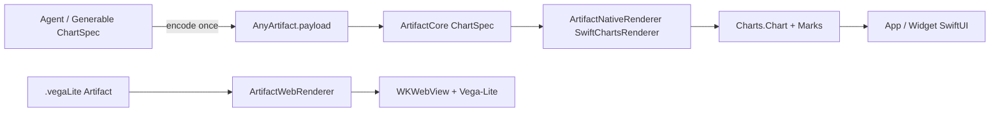

# swift-artifact

## Purpose and Scope

`swift-artifact` parses streamed `<artifact>` payloads and routes them to
SwiftUI renderers. The package owns the value model, refinement contract, view
dispatch, and built-in native and Web renderers. It does not own Agent
execution, persistence, networking policy, or Widget timeline scheduling.

The package also supports native Swift Charts artifacts through the
[`ArtifactChartSpec`](Sources/ArtifactCore/ChartSpec/DESIGN.md) contract. The
chart renderer remains independent from Foundation Models.

## Responsibilities and Boundaries

- `ArtifactCore` owns MIME identifiers, parsed artifact values, and the
  Codable chart specification. It has no SwiftUI or `Charts` dependency.
- `ArtifactRenderer` owns the refinement and type-erased renderer contracts.
- `ArtifactView` owns environment-driven renderer lookup and card composition.
- `ArtifactNativeRenderer` owns SwiftUI-native renderers, including the
  Swift Charts renderer.
- `ArtifactWebRenderer` owns WebKit-backed formats, including Vega-Lite.
- Agents produce chart specifications; this package validates and renders the
  resulting Artifact payload.

## Related Designs

| Design | Relationship | Contract Used | Summary |
|---|---|---|---|
| [`Sources/ArtifactCore/ChartSpec/DESIGN.md`](Sources/ArtifactCore/ChartSpec/DESIGN.md) | child | versioned `ArtifactChartSpec` | Defines the portable JSON chart data contract and validation boundary. |
| [`Sources/ArtifactNativeRenderer/Chart/DESIGN.md`](Sources/ArtifactNativeRenderer/Chart/DESIGN.md) | child | `ArtifactRenderable` + `ArtifactChartSpec` | Maps validated specifications to native `Charts` marks. |
| [`README.md`](README.md) | package usage | public products and renderer registration | Documents consumer-facing package and registry usage. |
| [`SPEC.md`](SPEC.md) | historical | none | Superseded draft; not normative for implementation decisions. |

## Architecture

## Contracts and Invariants

- `ArtifactType` remains an open MIME-space value; the native chart type is a
  custom versioned JSON MIME, not a replacement for `.json` or `.vegaLite`.
- Every renderer conforms to `ArtifactRenderable`; `ArtifactRenderer` and
  `ArtifactView` APIs remain unchanged.
- Chart payloads contain data and declarative encodings only. They never carry
  Swift closures, executable code, or live SwiftUI values.
- A complete but invalid chart payload renders an explicit renderer error; it
  is never silently displayed as a plain JSON artifact.
- Unknown chart features are rejected by the native renderer with a typed
  unsupported-feature error. Namespaced `extensions` are preserved by the
  Codable model for future renderer versions.
- Markdown image behavior and the existing Vega-Lite Web renderer remain
  unchanged.

## Runtime Flows

1. The stream parser creates an `AnyArtifact` whose payload is a string.
2. `SwiftChartsRenderer.refine` waits for a complete JSON document.
3. The renderer decodes and validates `ArtifactChartSpec`.
4. Valid fields are mapped to native Swift Charts marks.
5. The host registers the renderer through the existing environment registry.

## Failure, Concurrency, and Constraints

- JSON decoding, schema version, required channels, value types, date parsing,
  and mark-specific constraints are validated before constructing marks.
- Numeric values must be finite. Temporal values use ISO-8601 strings. Sector
  angles must be positive.
- The renderer is `Sendable`; Swift Charts view construction occurs on the
  existing `@MainActor` renderer boundary.
- 3D and arbitrary function plots are intentionally outside the first native
  renderer surface. A future version may add sampled `x/y/z` data without
  changing the current 2D contract.

## Verification and Change Impact

- `ArtifactCore` tests cover chart JSON round trips and schema validation.
- `ArtifactRenderer` tests cover incomplete, valid, invalid, and unsupported
  chart payloads.
- Package tests must pass on macOS 27, and `ArtifactNativeRenderer` must compile
  against the iOS 27 SDK. Existing renderer and Vega-Lite tests remain part of
  the regression gate.
