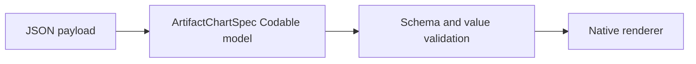

# Artifact Chart Specification

## Purpose and Scope

This component defines the portable, Codable representation consumed by the
native Swift Charts renderer. It lives in `ArtifactCore` and is independent of
SwiftUI, `Charts`, WidgetKit, and Foundation Models.

## Responsibilities and Boundaries

- Define a versioned chart document, row-oriented data, encoding channels, and
  renderer-neutral option values.
- Validate structural and value-type invariants before native rendering.
- Preserve namespaced extension values for future schema versions.
- Do not construct Swift Charts marks or interpret SwiftUI modifiers.

## Related Designs

| Design | Relationship | Contract Used | Summary |
|---|---|---|---|
| [`../../../../DESIGN.md`](../../../../DESIGN.md) | parent | package boundaries | Routes this value contract to the native renderer. |
| [`../../ArtifactNativeRenderer/Chart/DESIGN.md`](../../ArtifactNativeRenderer/Chart/DESIGN.md) | used by | decoded `ArtifactChartSpec` | Converts validated fields into `Charts` marks. |

## Architecture

## Contracts and Invariants

- `version` is required and currently `1`.
- `dimension` is `2d` for the initial renderer surface.
- `mark.type` is open-ended at decode time so unknown values can produce an
  explicit unsupported-feature error instead of a generic JSON failure.
- `data` is a list of rows. Each row is a map from field name to a JSON
  scalar or nested option value.
- `encoding` maps channel names (`x`, `y`, `z`, `series`, `color`, `size`,
  `symbol`, `angle`, `radius`, `xStart`, `xEnd`, `yStart`, `yEnd`) to a field
  and one of `quantitative`, `temporal`, `nominal`, or `ordinal`.
- Quantitative fields contain finite JSON numbers. Temporal fields contain
  ISO-8601 strings. Nominal and ordinal fields contain strings.
- Required channels depend on the mark: line, area, point, and bar require
  `x` and `y`; sector requires `angle`; rectangle requires `x` and `y`; rule
  requires `x` or `y`.
- `options` contains renderer-recognized declarative values. `extensions`
  contains namespaced values that may be preserved for a later version.
- The model never stores a closure, formatter object, SwiftUI type, or
  executable expression.

## Runtime Flows

The renderer decodes the complete payload with `JSONDecoder`, checks the
version, validates channel references against every row, parses temporal
strings, and then chooses the native mark implementation.

## Failure, Concurrency, and Constraints

- Invalid JSON, unsupported versions, missing channels, incompatible values,
  non-finite numbers, and invalid sector values are typed failures.
- Unknown mark types and renderer options remain distinguishable from malformed
  JSON so the host can show the actual unsupported feature.
- The value model is immutable, `Sendable`, and safe to pass across the
  existing renderer boundary.

## Verification and Change Impact

- Round-trip tests verify every public field and nested `ChartValue` shape.
- Negative tests verify missing channels, wrong value types, invalid dates,
  negative sector values, and unsupported versions.
- Any schema change requires a matching update to the native renderer design
  and its focused tests.
