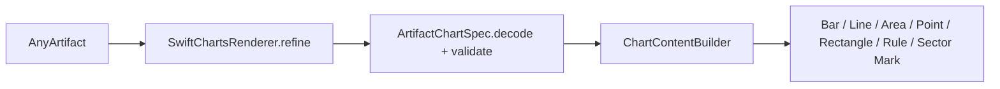

# Swift Charts Renderer

## Purpose and Scope

`SwiftChartsRenderer` is the native SwiftUI renderer for the versioned chart
Artifact defined by
[`ArtifactChartSpec`](../../ArtifactCore/ChartSpec/DESIGN.md). It maps a safe
declarative subset to Apple's `Charts` framework.

## Responsibilities and Boundaries

- Decode and validate complete chart payloads through `ArtifactChartSpec`.
- Build native `Chart` content for the supported 2D mark types.
- Surface typed unsupported-feature and malformed-payload errors in the view.
- Do not parse Markdown, use WebKit, execute code, or depend on Foundation
  Models.

## Related Designs

| Design | Relationship | Contract Used | Summary |
|---|---|---|---|
| [`../../../ArtifactCore/ChartSpec/DESIGN.md`](../../../ArtifactCore/ChartSpec/DESIGN.md) | depends on | `ArtifactChartSpec` | Owns portable data and schema validation. |
| [`../../../../DESIGN.md`](../../../../DESIGN.md) | parent | `ArtifactRenderable` | Owns package renderer registration and boundaries. |

## Architecture

## Contracts and Invariants

- `artifactType` is `application/vnd.swiftartifact.chart+json`.
- Incomplete payloads remain `.preRenderable`; a complete payload is either
  rendered or shown as an explicit error view.
- The renderer uses only validated row values and channel metadata.
- The chart-level `showLegend` option is supported; unsupported mark or chart
  options produce a typed error instead of being silently ignored.
- The first implementation supports 2D line, bar, area, point, rectangle,
  rule, and sector charts. It supports numeric, temporal, nominal, and ordinal
  x values with quantitative y values where the mark requires y.
- Series values are rendered through the existing Chart foreground-style
  mechanism. No arbitrary color closures or SwiftUI modifiers cross the
  Artifact boundary.
- The renderer remains a normal `ArtifactRenderable`; `ArtifactView` and the
  environment registry require no new entry point.

## Runtime Flows

The body decodes the refined payload, selects a mark builder, and constructs a
SwiftUI `Chart` on the main actor. Legend visibility and mark options are
applied only when their values are supported by this renderer version.

## Failure, Concurrency, and Constraints

- Decoder and validation failures become a visible error surface rather than a
  JSON fallback.
- Unsupported mark, dimension, or option values produce a typed error with the
  offending key.
- Native Swift Charts is selected for App and Widget targets that link
  `ArtifactNativeRenderer`; the existing Web renderer remains separate.
- Function plots and 3D surfaces are deferred until their serialized sampled
  data contract is defined.

## Verification and Change Impact

- Focused tests cover refinement, valid payloads, invalid payloads, and every
  supported mark's required channels.
- Package tests verify that the renderer compiles and is type-erased through
  `AnyArtifactRenderer`.
- macOS 27 and iOS 27 SDK builds are required after changes to this component.
